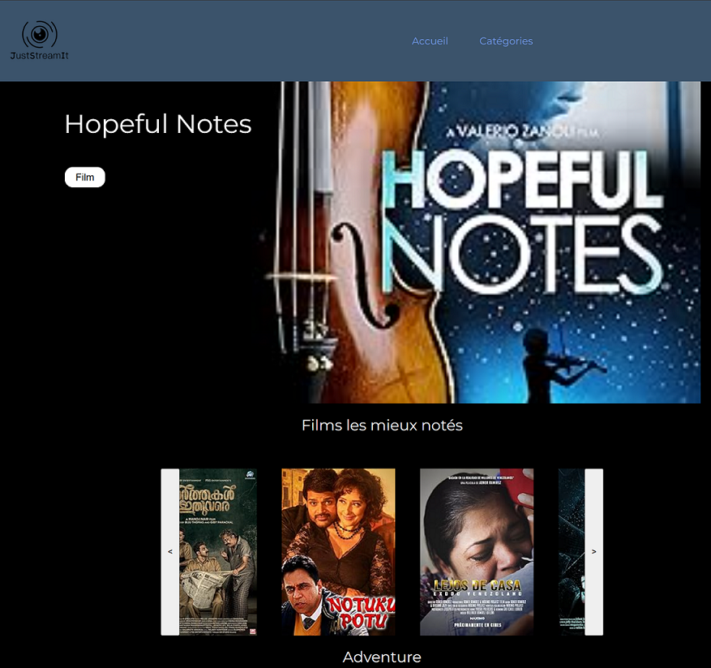

# OpenClassrooms: Projet 6 - Développez une interface utilisateur pour une application web Python

Projet réalisé dans le cadre de la formation OpenClassrooms Développeur d'Applications Python.
Il s'agit de développer une application Web pour l'association JustStreamIt.
L'application LitReviews, est un réseau social permettant de demander et poster des critiques de livres.

## Spécifications technique 

- Pas de framework (type boostrap , tailwind).
- Utilisation de HTML5 CSS3.
- Utilisation de javaScript Vanilla.

## Objectif

- Le site web présente le meileur film.
- une liste des 7 films les mieux noté.
- une liste des 7 meilleurs films de la catégorie Aventure.
- une liste des 7 meilleurs films de la catégorie Comedy.
- une liste des 7 meilleurs films de la catégorie Fanstasy.
- Un carroussel donne la possibilité de naviguer dans chacune des listes.

# BACK END : API OC MOVIES

1. installation du back end OCMovies-API :

cloner le repository git clone https://github.com/OpenClassrooms-Student-Center/OCMovies-API-EN-FR.git

** Suivre les instructions qui sont données dans cette page github : 
https://github.com/OpenClassrooms-Student-Center/OCMovies-API-EN-FR

# FRONT END : JustStreamIt

1. le projet a été testé sur Chrome / Firefox / Edge.
2. 2 possibilités pour lancer le front end.
    - via le live serveur de VScode. http://127.0.0.1:5500 (extension a téléchager sur vscode).
    - prendre le fichier index.html et l'envoyer sur votre navigateur.

